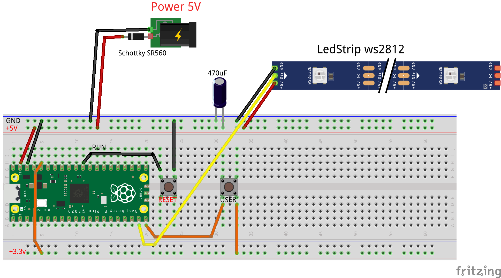
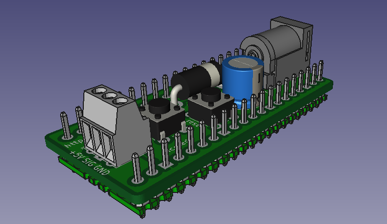
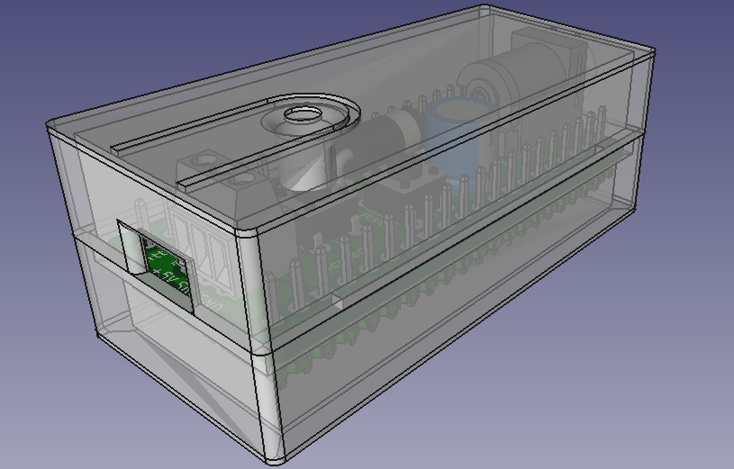

# picoleds_v2

Ruban de leds RGB commandé par un Raspberry PICO

## Electronique

### schéma sur platine d'essai

Un bouton poussoir (RESET) sert à faire un reset du circuit pour pouvoir reprogrammer le microcontrôleur par exemple.
L'autre bouton poussoir (USR) sert à modifier les animations. La diode Shottky SR560 est nécessaire si vous branchez le câble micro-usb en même temps que l'alimentation externe 5v: elle sert à éviter que les alimentations se "percuttent".

### Circuit imprimé

Un PCB peut être commandé chez n'importe quel fabriquant de PCB en utilisant les fichier GERBER dans le dossier **/KICAD_GERBER**

### Matériel nécessaire:
* un rapsberry PICO avec 2 rangées de 20 PIN Header soudées
* une diode shottkey SR560
* un petit bornier à souder 3pin 2.54mm (pour y brancher les 3 fils du ruban de leds)
* un condensateur polarisé 470uF
* une prise Jack à souder
* une alimentation 5v-2A Jack (si plus de 100 leds: prendre 3A)
* 2 petits boutons poussoir 6mm à souder
* Un ruban de leds RGB WS2812 (au delà de 100 leds il faudra envisager une alimentation 5v de 3A)

Le Raspberry PICO se soude par dessous le PCB (en tout dernier) la sortie USB est dans le même sens que la prise JACK, tout le reste se soude au-dessus.

### Impression 3D

Un boitier en 2 parties haute et basse compatible avec le PCB peut être imprimé en 3D.
les fichiers STL sont dans le dossier /STL.
Les deux éléments s'impriment face pleine vers le bas.
Seule la partie basse nécessite des supports à cause de l'ouverture USB du raspberry PICO

## Scripts Micro-python

Si vous configurez votre Raspberry PICO pour la première fois, suivez [ce guide](https://www.papsdroid.fr/post/hello-pico)

Les scripts micropython se trouvent dans le répertoire **/micropython** de ce Github.

Il faut installer la bibliothèque **ledRGBws2812.py** à la racine du PICO.
Ensuite vous avez deux programmes distincts selon l'ambiance que vous souhaitez obtenir:

* ambiance type guirlande de Noël: **main.noel.py**
* ambiance zen décontractée: **main_chill.py**

Choissiez l'un ou l'autre et renommez-le **main.py**, à deposer à la racine du PICO, ainsi il sera automatiquement exécutée au démarrage du PICO.
